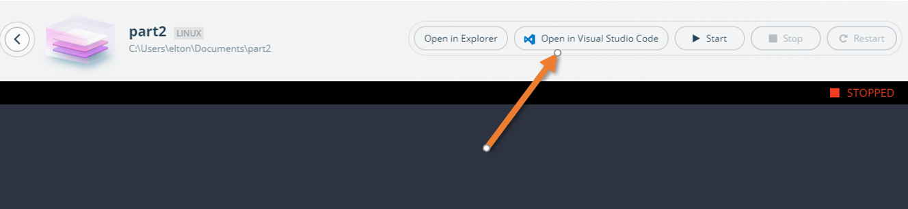

# Docker Templates for Arm TechCon 2019 Workshop


## Pre-requisites

All you need for the workshop is:

- [Visual Studio Code](https://code.visualstudio.com) a free cross-platform editor 
- A [Docker Hub ID](https://hub.docker.com/signup) to use the free Docker Hub to save your application packages
- [Docker Desktop Enterprise](https://hub.docker.com/editions/community/docker-desktop-ent) which you can run on Windows 10 or Mac OSX. 

> You'll be given a licence for Docker Desktop Enterprise at the workshop. This is a trial licence which is good for 90 days.

## Setup

We'll use Docker application templates for the workshop, which will make it very easy to follow along. The templates are in a GitHub repository, so you need to add that information to your local Docker Desktop configuration.

Open a terminal session on Mac or a PowerShell session in Windows. Then change to the configuration directory:

```
cd ~/.docker/application-template
```

And open the config file in a text editor.

_On Windows:_

```
notepad ./preferences.yaml
```

_On Mac:_

```
nano ./preferences.yaml
```

Replace the whole file contents with this:

```
apiVersion: v1alpha1
disableFeedback: false
kind: Preferences
repositories:
- name: techcon-2019
  url: https://raw.githubusercontent.com/sixeyed/techcon2019-templates/master/techcon-2019-templates.yaml
- name: library
  url: https://docker-application-template.s3.amazonaws.com/production/v0.1.5/library.yaml
```

> That adds a new repository for templates, so in addition to the standard Docker templates you'll see templates for today's workshop.

## Part 1

Part 1 of the workshop gets you used to working with Docker images on Arm machines.

Right-click the Docker whale icon in your toolbar and select _Design new application..._:


Then click _Choose a template_:


> If you're running Docker Desktop on Windows, you can choose between Linux and Windows containers. **Choose Linux**.

You'll see a list of templates, with the TechCon2019 templates listed first. Select _TechCon2019 Part 1: Cross-platform builds_:


Now you'll need to add your own details to the template. You need to provide:

- the IP address for your AWS A1 instance
- the SSH username for the A1 instance (the default `ubuntu` should be fine)
- your Docker Hub ID


> Make sure you use the correct IP address and Docker Hub ID. Docker Desktop will use those details when it generates the template.

Now click _Continue_ and give the app a name - this will be the location where the template gets rendered on your laptop. Then click _Scaffold_:


Docker Desktop renders the template, and when it's done you can click _Run application_. This app doesn't run anything locally - so click _Open in Visual Studio Code_ to work with the demo app for Part 1:



> Now open the `c-hello-world` folder, and follow the instructions in the `README.md` file. Come back here when you're ready for Part 2.


## Part 2

Part 2 of the workshop shows you how to use the Arm NN machine learning library with TensorFlow and Docker. There's a new Docker application template for Part 2.

Click the Docker whale icon in your toolbar and select _Design new application..._

You'll see your Part 1 app is listed. Click _New application_:


Then it's the same process as Part 1:

- Click _Choose a template_
- If you're running Docker Desktop on Windows, choose _Linux_ 

This time select _TechCon2019 Part 2: Machine Learning SDK_:


You'll need to add your own details to the template again. It's the same details to provide:

- the IP address for your AWS A1 instance
- the SSH username for the A1 instance (`ubuntu`)
- your Docker Hub ID


> Make sure you use the correct IP address and Docker Hub ID. Docker Desktop will use those details when it generates the template

Now click _Continue_, give the app a name and then click _Scaffold_.

Like before, click _Run application_ and then _Open in Visual Studio Code_ to work with the demo app for Part 2.

> Now open the `ml-armnn` folder, and follow the instructions in the `README.md` file. 


### Credits

- README docs were adapted from [Instructions for Arm Docker Workshop at TechCon 2019](https://armtechcon2019.s3.amazonaws.com/index.html)

- Original source code for demo apps is from [jasonrandrews/techcon2019](https://github.com/jasonrandrews/techcon2019.git)

